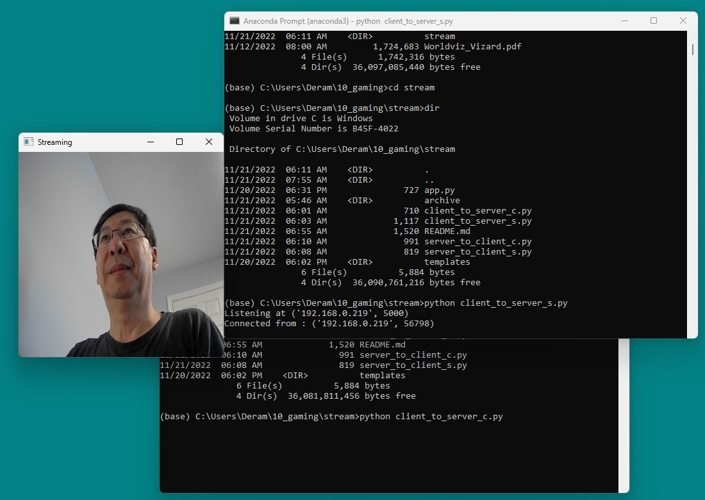

"Everything should be made as simple as possible, but not simpler."  
	- Albert Einstein

This is a demo showing how to apply follow key concepts and techniques  
for live video streaming in Python programs with minimum code (none of   
these five program is more than 50 lines).

1. Client-Server programming with socket [Ref 1]
2. Data Transfer with Protocol (simple header-body structure) [Ref 2]
3. Multi-thread (server side connection handling) [Ref 3]
4. Live Video with OpenCV (video capture and show at different sides)
5. Asynchronous Programming (client side key-event handling)
6. Web version with Flask (minimum code and html) [Ref 4]

Use Case 1: Stream live video from client to server (TCP/IP)  
Step 1: python client_to_server_s.py  
Step 2: python client_to_server_c.py (ESC to terminate)

Use Case 2: Stream live video from server to client (TCP/IP)  
Step 1: python server_to_client_s.py  
Step 2: python server_to_client_c.py (ESC to terminate)

Use Case 3: Stream live video from server to browser (HTTP)  
Step 1: python app.py  
Step 2  http://host:port/ (url in brower)

Parameters harded coded in demo:  
host = 192.168.0.219   
port = 5000  
packet_size = 4096  
window_size = 320x320 

[Ref 1] https://www.digitalocean.com/community/tutorials/python-socket-programming-server-client  
[Ref 2] https://stackoverflow.com/questions/48950962/screen-sharing-in-python  
[Ref 3] https://github.com/qijungu/screenshare  
[Ref 4] https://github.com/NakulLakhotia/Live-Streaming-using-OpenCV-Flask  
